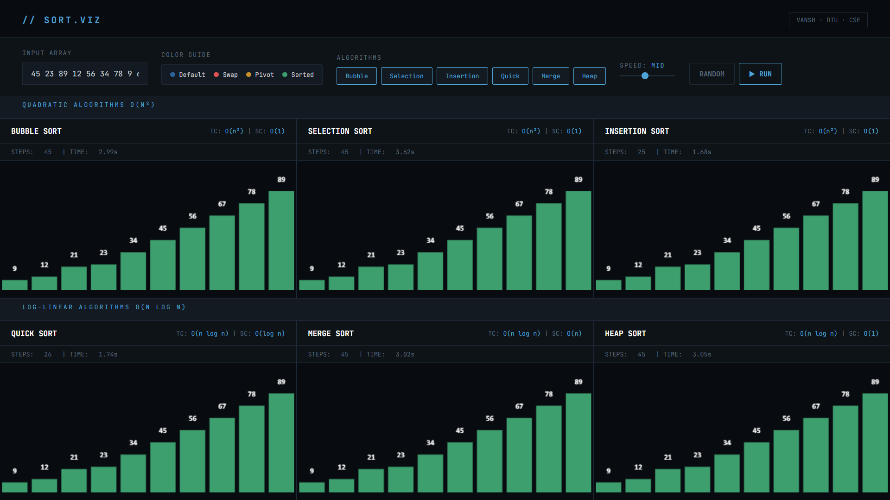
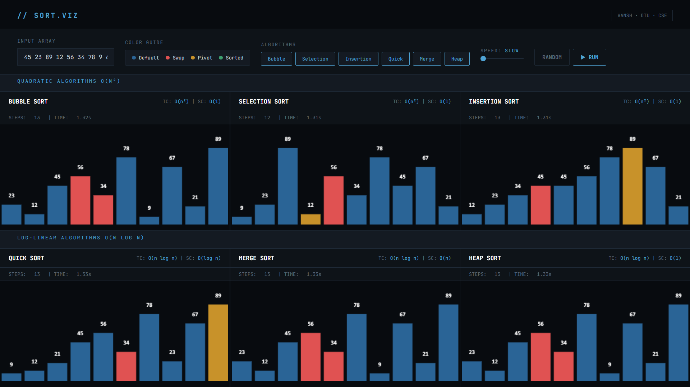

# 🔥 Sort.viz — Sorting Algorithm Visualizer

An interactive and advanced Sorting Algorithm Visualizer with real-time animations built using **HTML, CSS, and JavaScript**.

## 🚀 Features

* Visualize multiple sorting algorithms
* Real-time animation using Canvas
* Adjustable speed control
* Step counter and time tracking
* Clean dark UI

## 🧠 Algorithms Included

* Bubble Sort
* Selection Sort
* Insertion Sort
* Quick Sort
* Merge Sort (placeholder)
* Heap Sort (placeholder)

## 🛠️ Tech Stack

* HTML5
* CSS3 (Custom Dark Theme)
* JavaScript (ES6+)
* Canvas API

## ⚡ Key Concepts Used

* Generator Functions (`function*`)
* DOM Manipulation
* Animation using `requestAnimationFrame`
* Dynamic UI rendering
* State management

## 🚀 Highlights

* Built using JavaScript generator functions for step-by-step execution
* Real-time visualization using Canvas API
* Dynamic speed control and UI interactions

## 📸 Preview

Sorting visualization with:
* Color-coded comparisons
* Pivot highlighting
* Sorted state indication

## ▶️ How to Run

1. Download or clone the repo
2. Open `index.html` in browser

## 🎯 Future Improvements

* Add Merge Sort & Heap Sort actual implementation
* Add sound effects 🔊
* Add step-by-step mode
* Mobile optimization

## 👨‍💻 Author

**Vansh**
DTU · CSE
---

⭐ If you like this project, give it a star!
